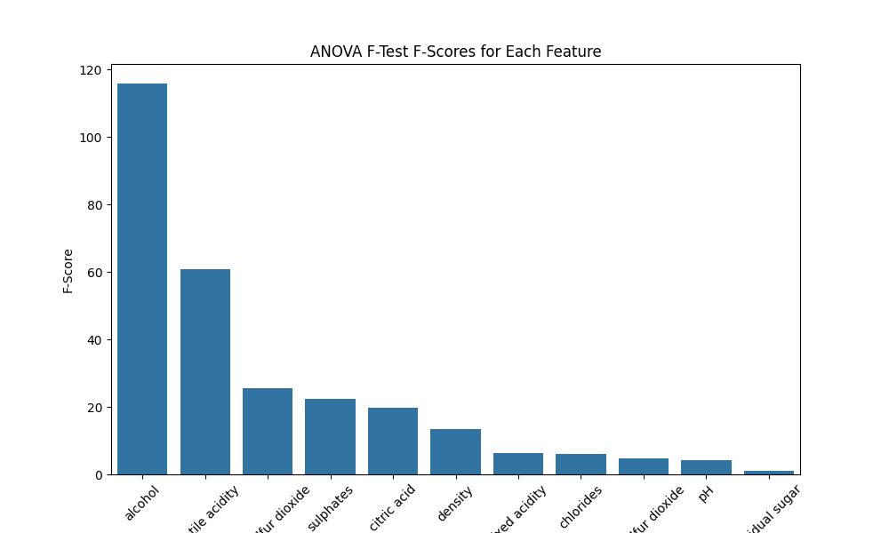
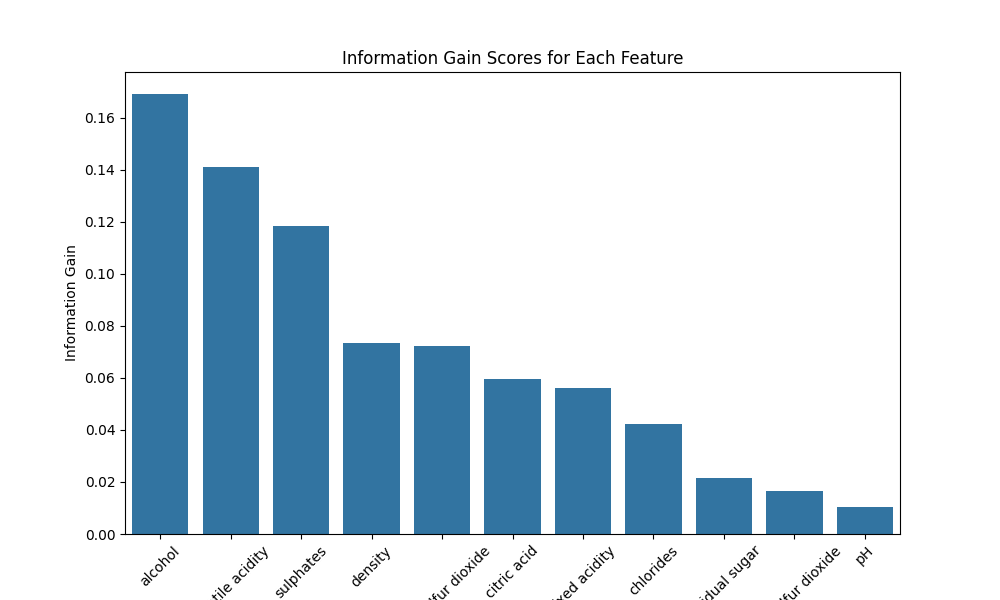
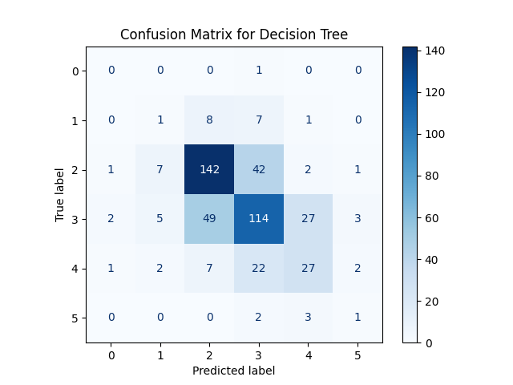

# Wine Quality Prediction

This project analyzes the Wine Quality dataset to predict the quality of wine based on its chemical properties. We will explore feature selection techniques and evaluate model performance.

## Table of Contents
- [Introduction](#introduction)
- [Dataset Overview](#dataset-overview)
- [Feature Selection Techniques](#feature-selection-techniques)
  - [ANOVA F-Test](#anova-f-test)
  - [Information Gain](#information-gain)
- [Model Performance](#model-performance)
- [Conclusion](#conclusion)

## Introduction

The goal of this analysis is to predict wine quality based on 11 chemical properties. By applying feature selection techniques, we aim to identify the most relevant properties that affect wine quality.

## Dataset Overview

The Wine Quality dataset consists of:
- **Features**: 11 chemical properties of wine (e.g., `fixed acidity`, `volatile acidity`, `citric acid`, etc.)
- **Target Variable**: `quality` – an integer rating from 3 to 8 representing wine quality.
- **Size**: 1599 samples with 11 features and 1 target variable.

### Code to Load the Wine Quality Dataset

```python
import pandas as pd

# Load the Wine Quality dataset directly from UCI repository
url = 'https://archive.ics.uci.edu/ml/machine-learning-databases/wine-quality/winequality-red.csv'
df = pd.read_csv(url, delimiter=';')

# Overview of the dataset
df.info()
df.head()
```

## Feature Selection Techniques

### ANOVA F-Test

The ANOVA F-test evaluates how well each feature differentiates wine quality scores.

#### ANOVA F-Test Results

```python
from sklearn.feature_selection import f_classif
import matplotlib.pyplot as plt
import seaborn as sns

# Define features and target
X = df.drop(columns='quality')
y = df['quality']

# Perform ANOVA F-test
f_scores, p_values = f_classif(X, y)

# Results as DataFrame
anova_results = pd.DataFrame({'Feature': X.columns, 'F-Score': f_scores, 'p-value': p_values})
anova_results = anova_results.sort_values(by='F-Score', ascending=False)

# Display ANOVA results
print(anova_results)

# Plotting the F-scores
plt.figure(figsize=(10, 6))
sns.barplot(x='Feature', y='F-Score', data=anova_results)
plt.xticks(rotation=45)
plt.title('ANOVA F-Test F-Scores for Each Feature')
plt.savefig('anova_f_scores.png')
plt.show()
```



#### Explanation of ANOVA F-Test
- **Concept**: Tests for statistically significant differences between means of multiple groups (wine quality levels).
- **Assumptions**: Assumes normally distributed data and equal variances among groups.
- **F-Statistic**: Ratio of variance between group means to variance within groups; higher values indicate a stronger relationship.

### Information Gain

Information Gain measures the reduction in uncertainty when knowing the value of a feature.

#### Information Gain Results

```python
from sklearn.feature_selection import mutual_info_classif

# Compute Information Gain
information_gain = mutual_info_classif(X, y)

# Results as DataFrame
information_gain_results = pd.DataFrame({'Feature': X.columns, 'Information Gain': information_gain})
information_gain_results = information_gain_results.sort_values(by='Information Gain', ascending=False)

# Display Information Gain results
print(information_gain_results)

# Plotting the Information Gain scores
plt.figure(figsize=(10, 6))
sns.barplot(x='Feature', y='Information Gain', data=information_gain_results)
plt.xticks(rotation=45)
plt.title('Information Gain Scores for Each Feature')
plt.savefig('information_gain.png')
plt.show()
```



#### Explanation of Information Gain
- **Concept**: Measures the amount of information gained about the target variable by knowing the value of a feature.
- **Calculation**: Derived from the entropy reduction when a feature is known.
- **Significance**: High Information Gain features contribute significantly to predicting the target variable.

## Model Performance

To evaluate the performance of selected features, we train several models and compare their accuracy, precision, and recall.

### Code for Model Performance Comparison

```python
from sklearn.model_selection import train_test_split, cross_val_score, GridSearchCV
from sklearn.linear_model import LogisticRegression
from sklearn.tree import DecisionTreeClassifier
from sklearn.ensemble import RandomForestClassifier, GradientBoostingClassifier
from sklearn.metrics import accuracy_score, precision_score, recall_score, confusion_matrix, ConfusionMatrixDisplay
from sklearn.preprocessing import StandardScaler
import numpy as np
import matplotlib.pyplot as plt

# Combine the top features from both methods
top_n = 5  # Adjust the number of top features as needed
top_features_anova = anova_results['Feature'].head(top_n).values
top_features_info_gain = information_gain_results['Feature'].head(top_n).values

# Combine and remove duplicates
combined_features = np.unique(np.concatenate((top_features_anova, top_features_info_gain)))

# Split data into training and testing sets using combined features
X_train, X_test, y_train, y_test = train_test_split(X[combined_features], y, test_size=0.3, random_state=42)

# Scale the data
scaler = StandardScaler()
X_train_scaled = scaler.fit_transform(X_train)
X_test_scaled = scaler.transform(X_test)

# Helper function to train and evaluate the model
def evaluate_model(X_train, X_test, y_train, y_test, model, model_name):
    model.fit(X_train, y_train)
    y_pred = model.predict(X_test)
    
    accuracy = accuracy_score(y_test, y_pred)
    precision = precision_score(y_test, y_pred, average='weighted', zero_division=0)
    recall = recall_score(y_test, y_pred, average='weighted')

    print(f"Model: {model_name}")
    print(f"  Accuracy: {accuracy:.4f}")
    print(f"  Precision: {precision:.4f}")
    print(f"  Recall: {recall:.4f}\n")

# Evaluate models
models = {
    "Decision Tree": DecisionTreeClassifier(),
    "Random Forest": RandomForestClassifier(),
    "Logistic Regression": LogisticRegression(max_iter=2000),
    "Gradient Boosting": GradientBoostingClassifier()
}

for model_name, model in models.items():
    print(f"Performance with {model_name}:")
    evaluate_model(X_train_scaled, X_test_scaled, y_train, y_test, model, model_name)

# Confusion Matrix for Decision Tree
decision_tree_model = DecisionTreeClassifier()
decision_tree_model.fit(X_train_scaled, y_train)
y_pred_tree = decision_tree_model.predict(X_test_scaled)

conf_matrix = confusion_matrix(y_test, y_pred_tree)
print("Confusion Matrix for Decision Tree:")
print(conf_matrix)

# Display the confusion matrix
ConfusionMatrixDisplay(confusion_matrix=conf_matrix).plot(cmap='Blues')
plt.title('Confusion Matrix for Decision Tree')
plt.savefig('confusion_matrix_decision_tree.png')
plt.show()
```

### Model Performance Summary

```
Performance with Decision Tree:
Model: Decision Tree
  Accuracy: 0.5854
  Precision: 0.5900
  Recall: 0.5854

Performance with Random Forest:
Model: Random Forest
  Accuracy: 0.6583
  Precision: 0.6301
  Recall: 0.6583

Performance with Logistic Regression:
Model: Logistic Regression
  Accuracy: 0.5542
  Precision: 0.5120
  Recall: 0.5542

Performance with Gradient Boosting:
Model: Gradient Boosting
  Accuracy: 0.6125
  Precision: 0.6006
  Recall: 0.6125

Best parameters for Random Forest: {'max_depth': None, 'min_samples_split': 2, 'n_estimators': 50}
Best cross-validated accuracy for Random Forest: 0.6765

Confusion Matrix for Decision Tree:
[[  0   0   0   1   0   0]
 [  0   1   8   7   1   0]
 [  1   7 142  42   2   1]
 [  2   5  49 114  27   3]
 [  1   2   7  22  27   2]
 [  0   0   0   2   3   1]]
```



## Conclusion

This analysis illustrates the effectiveness of various feature selection techniques in improving model performance. The Random Forest model achieved the highest accuracy, indicating that selected features significantly contribute to predicting wine quality.

Feel free to reach out if you have any questions or need further clarification!
